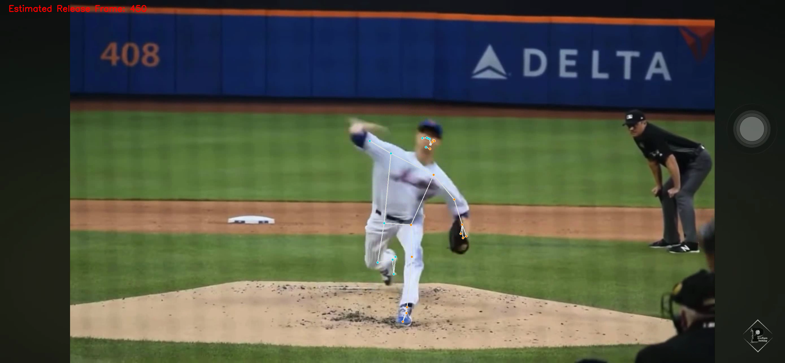
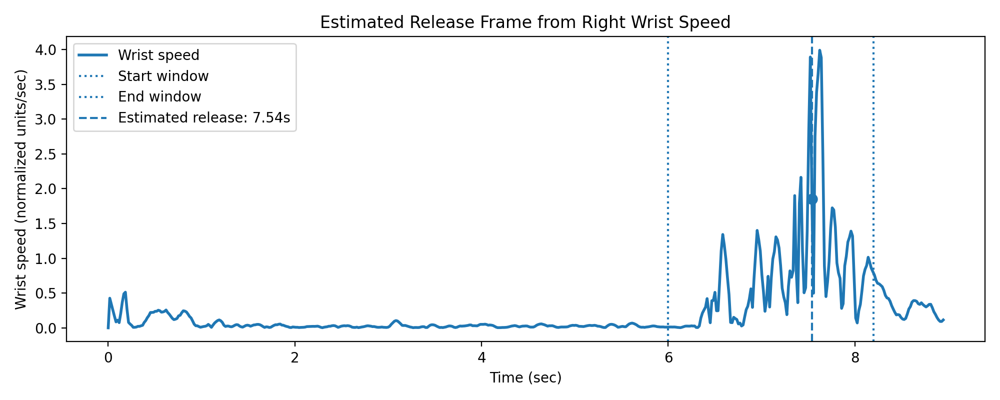
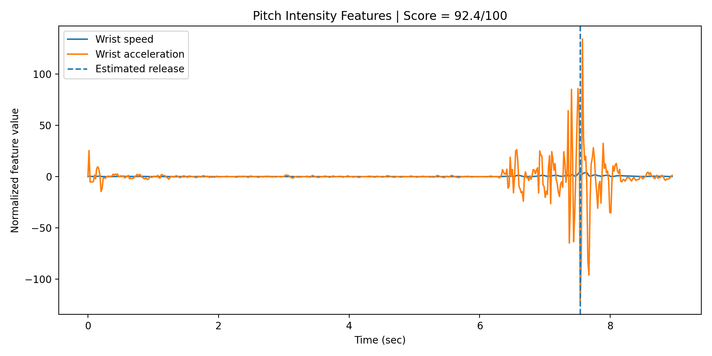

# PitchingMotionCV

PitchingMotionCV is a computer vision project for analyzing baseball pitching mechanics from low-resolution videos. Instead of directly tracking the baseball, which is difficult under motion blur and low visibility, this project estimates pitching motion features from pitcher pose trajectories.

## Project Motivation

In many baseball videos, especially broadcast or low-resolution clips, the baseball is too small, fast, or blurry to track reliably. Inspired by PitcherNet, this project explores whether pitcher body kinematics can be used as a proxy for pitch velocity and release timing.

## Core Idea

The system analyzes pitcher motion using pose estimation and time-series kinematic features.

Input:

- Baseball pitching video

Output:

- Skeleton overlay video
- Estimated release frame
- Wrist trajectory plot
- Wrist speed curve
- Pitch intensity score
- Confidence score
- Pitching mechanics summary report

## Pipeline

```text
Input pitching video
→ pitcher crop / detection
→ pose estimation
→ keypoint smoothing
→ release frame detection
→ kinematic feature extraction
→ pitch velocity proxy estimation
→ visualization and report generation
```

## Current MVP Result

Using a sample right-handed pitching video, the pipeline produced the following result:

| Metric | Value |
|---|---:|
| Estimated release frame | 450 |
| Estimated release time | 7.539 sec |
| Release confidence | Medium |
| Wrist speed peak | 3.893 |
| Wrist acceleration peak | 80.000 |
| Elbow extension speed peak | 1200.000 |
| 2D arm slot proxy | 113.60 degrees |
| Trunk tilt proxy | 6.85 degrees |
| Pitch intensity score | 92.42 / 100 |

The pitch intensity score is a pose-based motion proxy and should not be interpreted as official pitch velocity in miles per hour.


## Example Visual Outputs

### Estimated Release Frame



### Wrist Speed Curve and Estimated Release



### Pitch Intensity Feature Summary

